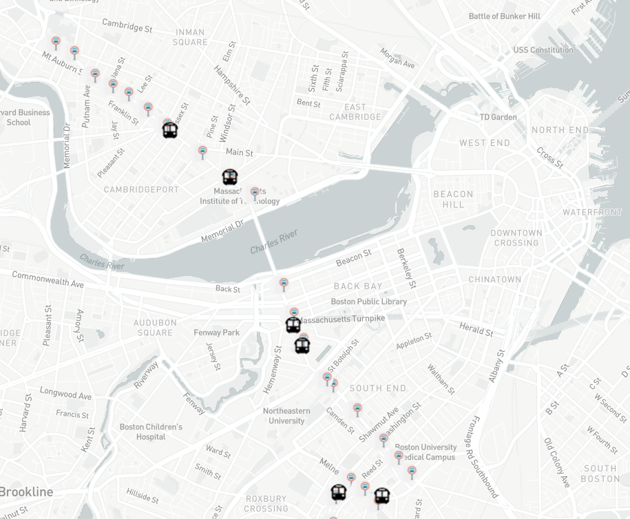

# MBTA Bus 1 Tracker

## Description of the project: 
This tracks the locations of the buses that run between MIT and Harvard. The bus locations update every 15 seconds.

## How to Run: 
Start by downloading all files in the same folder on your machine. Load the index.html file in your browser. The map updates every 15 seconds to show real-time bus location. The map can be dragged and zoomed in/out.

## Roadmap of future improvements: 
In the future I would like to add the direction of the buses to the popup event.

## License information: 
This project is licensed under the MIT License.
